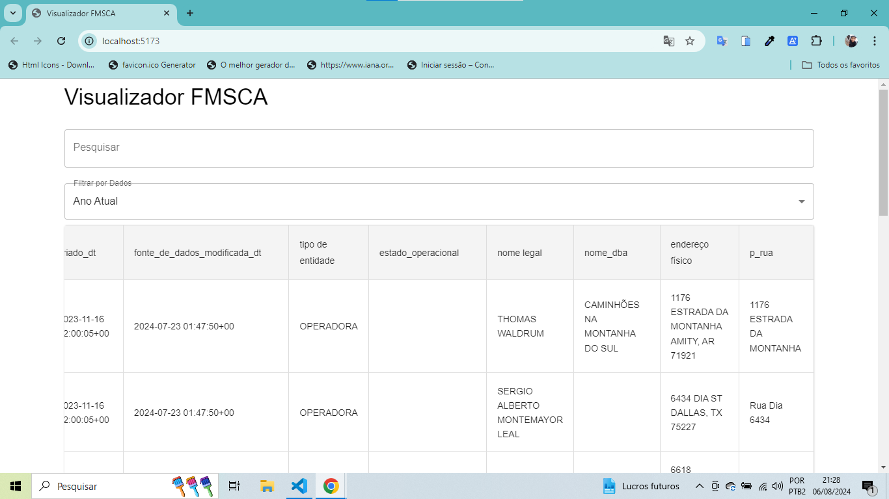

# React + Vite

# FMSCA Viewer



## 🎯 Objetivo

O **FMSCA Viewer** é uma aplicação web desenvolvida para visualizar e gerenciar dados da Federal Motor Carrier Safety Administration (FMCSA). Esta ferramenta permite aos usuários consultar informações de transportadoras, corretoras e outras entidades reguladas pelo Departamento de Transportes dos Estados Unidos. O projeto tem como objetivo fornecer uma visão centralizada e interativa dos registros, oferecendo funcionalidades avançadas como filtragem, ordenação e paginação de dados.

## ✨ Funcionalidades

- **Visualização em Tabela**: Exibição dos dados em formato de tabela usando Material-UI.
- **Paginação**: Navegação através de grandes conjuntos de dados com controle de páginas.
- **Filtros de Coluna**: Aplicação de filtros para pesquisa de dados específicos.
- **Classificação**: Ordenação dos dados por diferentes colunas.
- **Formatação de Datas**: Apresentação de datas no formato "dd/MM/yyyy".
- **Busca Dinâmica**: Filtros de pesquisa exibidos conforme necessário.
- **Tabela Dinâmica Ajustável**: Interface básica para ajustes nas colunas visíveis.
- **Agrupamento por Períodos**: Filtragem dos dados por mês, semana ou ano.

## 🛠️ Tecnologias Utilizadas

- **React**: Biblioteca para construção da interface de usuário.
- **Material-UI**: Biblioteca de componentes React para criar interfaces de usuário elegantes e responsivas.
- **Axios**: Biblioteca para realizar requisições HTTP.
- **date-fns**: Biblioteca para manipulação e formatação de datas.
- **Vite**: Ferramenta para desenvolvimento e construção de aplicações web.

## 📁 Estrutura do Projeto

### `App.jsx`

- **Descrição**: Componente principal que gerencia a lógica de busca, ordenação, paginação e renderização da tabela.
- **Funcionalidades**:
  - Busca e exibição dos dados.
  - Aplicação de filtros e ordenação.
  - Paginação e controle de visualização.

### `DynamicTable.jsx`

- **Descrição**: Componente que exibe os dados em uma tabela com suporte para ordenação e filtros.
- **Funcionalidades**:
  - Renderização das colunas e linhas da tabela.
  - Suporte para ordenação de colunas.

## 🚀 Como Usar

### Configuração Inicial

1. Clone este repositório:
   ```bash
   git clone https://github.com/Michaelrodriguesds/Visualizador-FMSCA.git
Instale as dependências:
npm install
Execução do Projeto
Inicie o servidor de desenvolvimento:
npm run dev
Acesse a aplicação no seu navegador em http://localhost:3000.

Interação com a Tabela
Utilize a caixa de pesquisa para filtrar os dados.
Use os menus suspensos para filtrar por data.
Navegue pelas páginas usando o controle de paginação.
Ordene as colunas clicando nos cabeçalhos da tabela.

🌟 Desafios e Aprendizado
Desenvolver o FMSCA Viewer foi uma jornada desafiadora e enriquecedora. Como iniciante na programação, enfrentar os desafios técnicos e aprender a integrar diferentes tecnologias foi um grande aprendizado.

Desenvolvimento Front-End: Aprendi a usar React e Material-UI para criar uma interface de usuário dinâmica e responsiva.
Manipulação de Dados: Trabalhei com APIs e manipulação de dados usando Axios e date-fns.
Interface de Usuário: A criação de uma tabela interativa com funcionalidades avançadas foi um desafio que me proporcionou uma compreensão mais profunda da construção de aplicações web.
Este projeto não apenas melhorou minhas habilidades de programação, mas também me ensinou a importância da perseverança e da atenção aos detalhes na construção de soluções eficazes.

🏁 Conclusão
O FMSCA Viewer é uma aplicação robusta e funcional que atende aos requisitos de visualização e manipulação de dados da FMCSA. Desenvolver este projeto foi um grande desafio, mas também uma experiência de aprendizado valiosa que aprimorou minhas habilidades e me preparou para futuros desafios na programação.


- [@vitejs/plugin-react](https://github.com/vitejs/vite-plugin-react/blob/main/packages/plugin-react/README.md) uses [Babel](https://babeljs.io/) for Fast Refresh
- [@vitejs/plugin-react-swc](https://github.com/vitejs/vite-plugin-react-swc) uses [SWC](https://swc.rs/) for Fast Refresh
